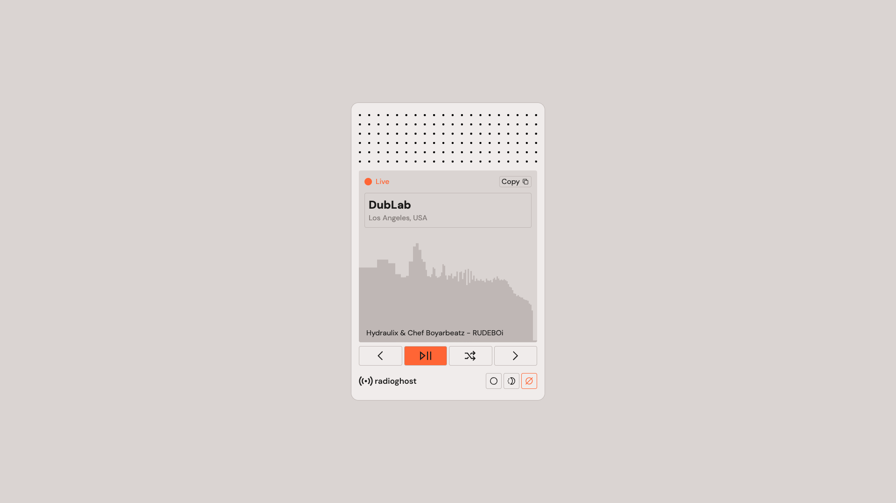

# radioghost



A minimal browser radio player for streaming radio stations. It looks like a small hardware radio, works on phones and desktops, and needs no build step and no framework: it is static HTML, CSS and JavaScript.

Live at [radio.renderg.host](https://radio.renderg.host).

## Features

- A curated station list, defined in one JSON file
- Play/stop, previous, next and random station, all with keyboard shortcuts
- Dead stations are skipped like tuning a real dial, and dropped streams are retried automatically
- A live frequency visualizer that fills all the available height
- Now playing text for stations that publish it
- Shareable links to a station, and the last station is remembered
- Light, dark and system display modes
- Fits phones (including ones with a notch), tablets and desktops, and installs as an app
- Lock screen and hardware media key controls

## Run locally

Serve the folder with any static file server, e.g.:

```
npx live-server --port=8080
```

Then open [http://localhost:8080](http://localhost:8080).

## Controls

| Control               | What it does                                                                             |
| --------------------- | ---------------------------------------------------------------------------------------- |
| Station name          | Opens the station list. Pick a station to play it, or click outside the list to close it |
| Copy                  | Copies a link to the current station                                                     |
| Previous / Next       | Tunes to the previous or next station, wrapping around at either end                     |
| Play / Stop           | Starts or stops playback. Screen readers hear "Retry" after a failure                    |
| Random                | Jumps to a random station other than the current one                                     |
| Light / Dark / System | Chooses the display mode (bottom right)                                                  |

### Keyboard shortcuts

| Key       | Action                   |
| --------- | ------------------------ |
| `Space`   | Play or stop             |
| `←` / `→` | Previous or next station |
| `R`       | Random station           |

The shortcuts work anywhere on the page, including while the station list is open. Holding one of them does not repeat the action, although holding `↑` or `↓` in the list keeps moving. Combinations with Ctrl, Cmd or Alt are left to the browser, so `Cmd+R` still reloads the page.

With the station list open:

| Key            | Action                            |
| -------------- | --------------------------------- |
| `↑` / `↓`      | Move through the stations         |
| `Home` / `End` | Jump to the first or last station |
| `Enter`        | Play the highlighted station      |
| `Esc`          | Close the list                    |
| `Tab`          | Moves focus as usual              |

> [!NOTE]
> With the list open, `Space` still plays or stops instead of selecting the highlighted row. Use `Enter` to select.

### Media keys and lock screen

Media Session integration gives you the OS controls (lock screen, Control Centre, headphone buttons and keyboard media keys) for play, pause, previous and next. Seek controls are deliberately not registered, because iOS shows either the previous/next pair or the seek pair, never both. There is no Media Session action for random.

### Sharing and remembering

The address bar always carries the current station as `?station=<slug>`, so both the Copy button and the URL give a link that opens that station. Opening a link selects the station but never starts playback by itself, because browsers block autoplay. Without a link, the last station is restored. The display mode is remembered too. Both live in `localStorage` (`ghost-radio:index` and `ghost-radio:theme`).

## Status and failures

| Label       | Meaning                                                             |
| ----------- | ------------------------------------------------------------------- |
| Off Air     | Stopped                                                             |
| Seeking...  | Connecting to a station                                             |
| Live        | Audio is playing                                                    |
| Not Found   | A station never connected. Shown briefly, then the search continues |
| Signal Lost | A station that was live has dropped and is being retried            |
| No Signal   | A full lap of the dial found nothing live                           |
| Offline     | The device has no network                                           |

Tuning works like a real dial. If a station does not connect within 10 seconds, or errors, the player moves on in the direction you were travelling and wraps around until it finds a live one. Previous searches backwards, and everything else (play, next, random, picking from the list) searches forwards. If it comes all the way round to where it started, it stops on No Signal.

A station that was already live and then drops is retried on its own URL up to 3 times, 3 seconds apart, before it is treated as dead. With no network the player parks on Offline instead of trying every station, and clears the label when the connection returns, without resuming playback on its own.

While playing, the tab title shows the station name and the favicon switches to an orange on air icon. In the other states the tab title shows the status label.

## Now playing

Stations that publish track or show information show it as a line of text over the bottom of the visualizer. Long titles scroll and short ones sit still, and the scrolling is switched off when the OS asks for reduced motion. The text is refreshed every 15 seconds while a station plays, and tidied before it is shown (character encoding repairs, stray quotes and HTML entities). A station opts in with a `nowPlaying` block, see [Stations](#stations).

## Visualisation

A live frequency visualizer (128 log-spaced bands) runs while playing, using the Web Audio API. It stretches to fill whatever height the screen gives it. While a station is connecting it shows a moving wave.

> [!IMPORTANT]
> Most streams don't send CORS headers, so the player first tries a CORS-enabled load (needed for the analyser to read audio data) and silently falls back to plain playback if that fails. Audio still plays, but the bars show a simulated animation instead of real audio data.

## Stations

Edit `stations.json` in the project root. There is no fixed limit on the number of stations, and the buttons and the list cover however many are listed. Each entry supports:

| Field        | Required    | Description                                                                                                                                                    |
| ------------ | ----------- | -------------------------------------------------------------------------------------------------------------------------------------------------------------- |
| `title`      | yes         | The name shown in the display and the list                                                                                                                     |
| `streamUrl`  | yes         | A direct stream URL                                                                                                                                            |
| `location`   | no          | Shown under the name, e.g. `City, Country`                                                                                                                     |
| `slug`       | recommended | A short unique id used in share links (`?station=slug`). A station without one cannot be linked to                                                             |
| `noCors`     | no          | Set to `true` for servers whose CORS headers are broken. Skips the CORS attempt and uses a separate plain audio element, so the visualizer is always simulated |
| `nowPlaying` | no          | Where to get now playing text, see below                                                                                                                       |

Entries without a `title` or a `streamUrl` are ignored.

```json
{
  "title": "Station Name",
  "slug": "station-name",
  "streamUrl": "https://example.com/stream.mp3",
  "location": "City, Country",
  "nowPlaying": { "type": "somafm", "channel": "groovesalad" }
}
```

### Now playing sources

`nowPlaying.type` picks the source, and the other fields depend on it:

| `type`         | Extra fields                     | Source                                                                                                |
| -------------- | -------------------------------- | ----------------------------------------------------------------------------------------------------- |
| `somafm`       | `channel`                        | A SomaFM channel id                                                                                   |
| `radioco`      | `stationId`                      | A Radio.co station id                                                                                 |
| `icecast-json` | `statusUrl`, `listenUrlContains` | An Icecast `status-json.xsl` URL, and a fragment of this station's listen URL to pick the right mount |
| `azuracast`    | `apiUrl`                         | An AzuraCast now playing API URL                                                                      |
| `airtime`      | `slug`                           | The Airtime Pro sub domain of the station                                                             |
| `nts`          | `channel`                        | An NTS channel number. Shows the current show title                                                   |
| `wnyc`         | `slug`                           | A WNYC/WQXR stream slug. Currently blocked by the API's CORS policy on this site, so it shows nothing |
| `alhara`       | none                             | Radio Alhara                                                                                          |

> [!IMPORTANT]
> Direct MP3/AAC Icecast/Shoutcast streams play via a plain `<audio>` element. HLS (`.m3u8`) streams only play in browsers with native HLS support (e.g. Safari), because no HLS library is bundled. When the site is served over HTTPS, stream URLs must be HTTPS too.

## Display mode

- `Light` / `Dark` / `System`, chosen with the three buttons at the bottom right and remembered in `localStorage`
- System follows the OS colour scheme automatically, and switches live when it changes
- The browser theme colour (the address bar on mobile) follows the mode

## Layout and devices

- The card fills the height of the screen on phones, and respects the notch and the home indicator (`viewport-fit=cover` and the safe area insets)
- From 600px wide the card is capped at 416 by 640 pixels and centred
- The visualizer takes all the spare height, so taller screens simply get a bigger visualizer
- If the window is too short for the display, the page scrolls instead of squeezing the card, and in short landscape windows (under 480px tall) the speaker grille is hidden to give the display room
- Hover styles only apply on devices that can hover, so nothing sticks after a tap on iOS

## Installing and offline

radioghost has a web app manifest and a small service worker, so it can be added to the home screen and opens in its own window without browser chrome. The service worker caches only the app shell (the page, styles, script, station list and art) with a stale while revalidate strategy, so the app opens instantly and refreshes in the background. Audio streams and now playing requests are never cached or intercepted. Offline, the interface opens but the streams need a network.

## Architecture

```
index.html      Structure, plus Open Graph and Twitter card metadata
styles.css      All styling: tokens, layout and buttons
app.js          A single state object plus a render() function
stations.json   The station list
manifest.json   Web app manifest
sw.js           Service worker that caches the app shell
art/            Icons, logos, favicons, the speaker grille and the social image
CNAME           Custom domain for GitHub Pages
```

`app.js` has no framework and no build step, and is intended to be easy to extend by hand.

### Styling

- Design tokens are CSS custom properties at the top of `styles.css`. Colours, spacing and radii use the same names as the Figma variables (`--bg`, `--bg-card`, `--text`, `--text-muted`, `--border`, `--accent`, `--button-bg-panel`, `--button-bg-display`, `--button-bg-accent`, their `-hover` variants, `--space-*` and `--radius-*`). Dark mode only overrides the token values in `html[data-theme="dark"]`, so no component rule mentions a theme
- Every button is a `.btn`. It reads its fill from `--btn-bg` and `--btn-bg-hover`, which the surface it sits on provides (`.radio` for the card, `.display` for the display), so a button automatically matches where it lives
- Class names follow the Figma hierarchy: `speaker`, `content` (with `data-state="player"` or `"selector"`), `display`, `media-controls`, `station-list` and `footer`
- Icons are the SVGs in `art/`, painted with a CSS mask so they take the current text colour
- The speaker grille is `art/dots.svg`, scaled to the card width. To change it, swap that file
- Layout numbers such as the card size and its minimum height are tokens too. `--safe-top`, `--safe-right`, `--safe-bottom` and `--safe-left` wrap the device safe area insets, so you can emulate a notch on desktop from the devtools console:

```js
const root = document.documentElement.style;
root.setProperty("--safe-top", "59px");
root.setProperty("--safe-bottom", "34px");
```

### Working on it

- There is no build step and no dependencies. The only external asset is the DM Sans font from Google Fonts, and streams and now playing APIs are fetched at runtime
- Whenever you change a file that the service worker caches (see `SHELL_FILES` in `sw.js`), bump `CACHE_NAME` so returning visitors get the new version. A file listed there that does not exist breaks the service worker install
- There is no automated test suite. Check changes by serving the folder and trying light and dark, a phone sized window and the keyboard shortcuts
